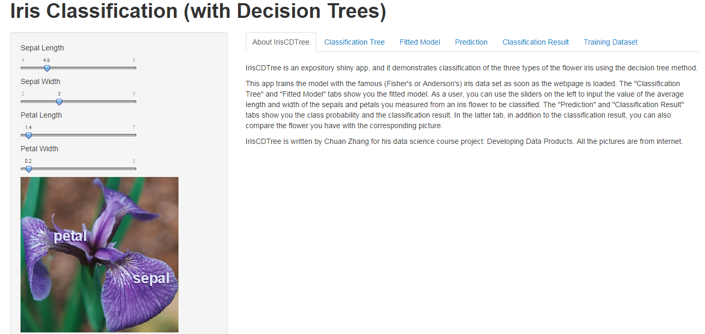
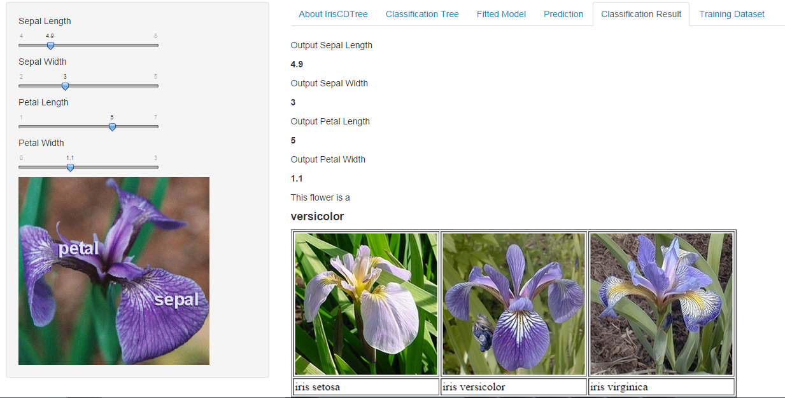

## About IrisCDTree

<font size=6> IrisCDTree (https://chuan.shinyapps.io/IrisCDTree) is an expository shiny app, and it demonstrates classification of the three types of the flower iris using the decision tree method. </font>

</img>


--- 


## Iris Data Set

<font size=6> IrisCDTree trains a decision tree model with the famous (Fisher's or Anderson's) iris data set. Below is the first few observations from this data set.</font>

```{r}
data(iris)
head(iris)
```


---


## Decision Tree Model

<font size=6> As the webpage is being loaded, IrisCDTree trains the model with all the 150 observations of the data set. Below is the trained tree model.</font>

```{r, warning=FALSE, results='hide', fig.width=4, fig.height=4}
library(rattle); library(rpart)
modFit <- rpart(Species ~ ., data=iris); fancyRpartPlot(modFit)
```


---


## On this slide we finish this presentation


<font size=6> After the webpage is loaded, you can use the slider bars on the left hand side to input the four parameters of an iris flower you may have. Based on the trained decision tree model, the app will tell you which type your iris flower is, and you may compare yours with a sample picture. </font>

</img>
